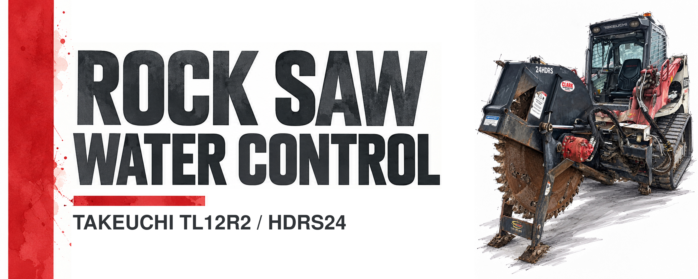
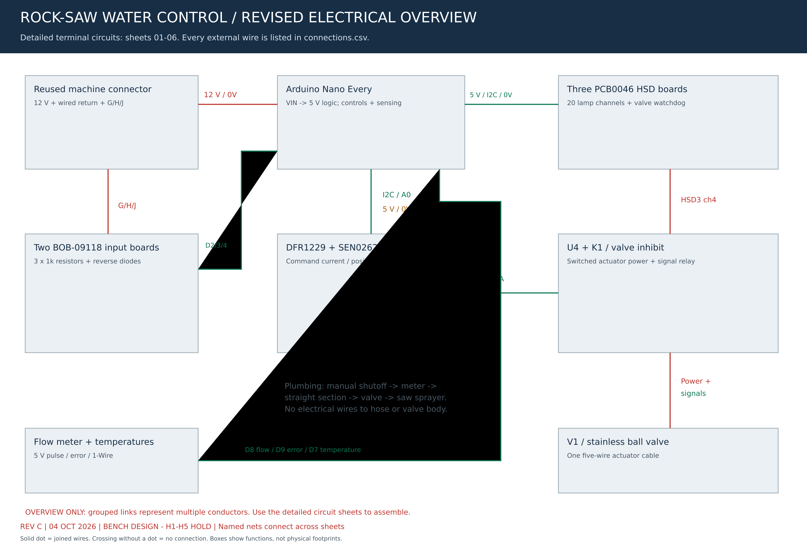
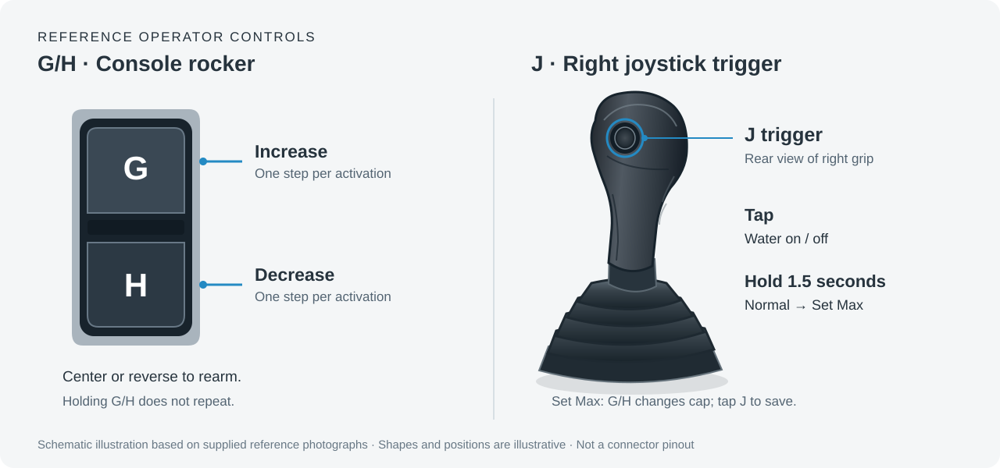

# Rock Saw Water Control

**[▶ Open Live Simulator](https://aeae1.github.io/Rock-Saw-Water-Control/)** · **[Operator guide](docs/operator-guide.md)** · [Build and wiring guide](docs/build-guide.md) · **[Audited schematic PDF](docs/assets/hardware/water-controller-audit-rev-c.pdf)**

A configurable attachment water controller for machines that provide three independent operator-control outputs. The proposed system adjusts a motorized water valve and presents operating status on ten blue/white indicator lamps. Typical applications include rock saws and other attachments supplied from a pressurized water hose.

**Project status:** interactive simulator and Revision C electrical bench design. The [connection audit](docs/hardware-audit-2026-10-04.md) includes circuit sheets, 138 individual connections, parts, tests and power-up checks. Machine harness verification, protection coordination, actual component qualification, actuator characterization and firmware/bench testing remain release holds. No hardware-ready firmware is included.

## Electrical overview



*Reviewed 4 October 2026. This overview groups conductors by function. Use the [six detailed circuit sheets and audit](docs/assets/hardware/water-controller-audit-rev-c.pdf), [connection schedule](hardware/rev-c/connections.csv) and [parts schedule](hardware/rev-c/bom.csv) for terminal details. The package remains a bench design with explicit hardware release holds.*

| Function | Current component direction |
| :--- | :--- |
| Main controller | [Arduino Nano Every](https://store-usa.arduino.cc/products/nano-every), supplied through VIN from the machine's nominal 12 V supply |
| Operator inputs | Two SparkFun BOB-09118 two-channel opto boards with three external 1 kohm input resistors and reverse-voltage diodes; their HV terminals receive regulated 5 V |
| Lamp switching | Three [Serial Wombat PCB0046 HSD](https://www.serialwombat.com/p46) V2 boards: twenty lamp outputs, one proposed valve-watchdog output, three unused. Current price and availability have not been verified. |
| Indicators | Ten common-negative 12 V blue/white lamps; each color has its own switched positive lead |
| Valve command | [DFRobot DFR1229](https://wiki.dfrobot.com/dfr1229/) configured for 4–20 mA current output |
| Valve feedback | [DFRobot SEN0262](https://wiki.dfrobot.com/sen0262/) converts position feedback to a voltage for the Nano's analog input; this receiver is not an I²C device |
| Water valve | [U.S. Solid USS-MSV50030](https://ussolid.com/products/1-2-proportional-motorized-ball-valve-stainless-steel-dc-9-24v-4-20ma-control-5-wire-ip67-full-port), 1/2-inch stainless proportional ball valve with integrated actuator |
| Flow meter | ScioSense UFM-02-03NP4 four-wire pulse meter; regulated 5 V, separate flow/error inputs |
| Supervision and temperature | Proposed local HSD watchdog, TQ2-5V signal relay with dedicated L7805ABV regulator, and two powered DS18B20 sensors; physical qualification required |

The reference installation reuses its existing 14-pin connector for the constant 12 V supply, wired ground return, and three control signals. Power is distributed inside the controller; the selected layout relies on the existing machine fuse and includes no additional fuse block or separate power source. This is an installation-specific arrangement, not a universal connector pinout. Whether the supply remains live with the ignition off must be verified: startup behavior follows controller power-up or reset, not necessarily the machine's key cycle.

The valve has **one five-conductor cable from its actuator housing**. The motor and position-control electronics are inside that housing; there are no electrical connections to the stainless valve body or water hoses. The [manufacturer's wiring table](https://file.ussolid.com/content/JFMSV/Manual-5003X.pdf) identifies red as power positive, black as power negative, green as command positive, white as signal common, and yellow as position-feedback positive.

The electronics require a suitable weatherproof enclosure. Power budgets, fault behavior and environmental suitability require bench verification. The current [electrical audit](docs/hardware-audit-2026-10-04.md) supersedes earlier wiring concepts; the [2026-10-03 audit](docs/audit-2026-10-03.md) remains the historical software review. Automated wiring checks validate the documented topology, not physical field reliability.

## Simulator

The simulator implements the proposed operator interface, valve motion, maximum-opening configuration, startup indication, and diagnostic previews. It operates entirely in the browser and requires no account or network connection after loading.

To run locally, open [`docs/index.html`](docs/index.html) in a current browser, or serve the `docs` directory:

```sh
python3 -m http.server 8000 --directory docs
```

Then open `http://localhost:8000`. GitHub Pages configuration is described in [Publishing](docs/publishing.md). The hosted version is available at [aeae1.github.io/Rock-Saw-Water-Control](https://aeae1.github.io/Rock-Saw-Water-Control/).

## Machine compatibility

The control scheme requires three functions: **increase**, **decrease**, and **toggle/setup**. These can be provided by a two-direction joystick rocker plus a trigger, three suitable joystick outputs, or equivalent operator controls. The control logic is independent of the machine manufacturer.

The Takeuchi TL12R2 with an HDRS24 rock saw is the reference installation. The attachment manufacturer has not been confirmed. Its G, H, and J labels are used in the simulator and table below; other machines can map their outputs to the same functions. Connector type, supply voltage, signal polarity, protection, and existing attachment functions must be verified for each installation. Three available outputs establish the interface concept, not plug-and-play electrical compatibility.

## Operating interface



The illustration shows the reference machine controls schematically. It is not a connector pinout.

### Three modes

| Mode | Purpose | Controls |
| :--- | :--- | :--- |
| **Normal** | Everyday water adjustment | Tap J for on/off. G increases the level; H decreases it. |
| **Set Max** | Choose what level 10 means | Hold J for 1.5 seconds from Normal, then release. G/H changes the cap from 10–100%. Tap J to save and return. |
| **Flush** | Temporarily open the valve fully | In Set Max, release J and hold it again for 1.5 seconds. A fresh J press returns immediately to the previous Normal on/off state. |

Start with G/H centered and J released. Startup commands closing, then requires released/centered controls for 0.1 seconds before accepting a fresh command. A held startup input cannot trigger an action on release. G/H makes one change per activation; center or reverse to rearm. A tap is shorter than 0.5 seconds. Releasing J between 0.5 and 1.5 seconds cancels the hold without changing anything.

In Set Max, running water holds its current valve opening while the cap is edited. An existing OFF command continues closing. Saving selects the nearest repeatable opening under the new cap: 40% opening becomes level 8 at a 50% maximum, or level 7 at a 60% maximum (42% opening). Flush temporarily bypasses the cap and locks G/H.

Blue lamps indicate the running level; white lamps indicate the saved paused level. While paused, the maximum lamp blinks blue/off above the white bar or blue/white within it. Set Max uses one alternating blue/white lamp. Mode-changing holds show an inward white fill after 0.5 seconds; Flush uses an outward white ripple.

Faults latch, stop movement, and inhibit opening. Correct the cause, release J, center G/H, then hold J for three seconds to acknowledge. Recovery closes the valve and leaves water off. **Stopping movement or losing electrical power does not guarantee that water stops.** The [operator guide](docs/operator-guide.md) explains routine use and recovery; the [fault reference](docs/faults.md) defines all ten codes and detection limits.

The current simulator uses valve-opening percentages. The planned hardware will use a measured [flow-calibration curve](docs/flow-calibration.md) so levels represent calibrated flow percentages; this requires real valve/nozzle measurements and does not provide live measured GPM. The water animation is illustrative. Settings and fault latches survive the simulator's power switch, but reset on page reload.

## Architecture

The current bench direction is the [electrical overview](#electrical-overview): an Arduino Nano Every, conditioned machine inputs, prebuilt high-side lamp drivers, and a wired proportional valve with 4–20 mA command and feedback. Ten dual-color lamps require twenty independently switched power channels. The valve includes its motor, gearbox, and motor controller; it needs no separate motor or H-bridge.

The [build guide](docs/build-guide.md) describes the current component list, partial pricing, wiring relationships, enclosure plan and programming sequence. The complete cost remains open because driver-board pricing and several assembly choices are unverified. The [valve-control research](docs/valve-control-research.md) retains the cheaper reversing-valve and Tuya alternatives. Local Tuya percentage control has not been verified for the candidate smart valve.

## Documentation

| Document | Purpose |
| :--- | :--- |
| [Operator guide](docs/operator-guide.md) | Plain-language instructions for Normal, Set Max, Flush, and recovery |
| [Build and wiring guide](docs/build-guide.md) | Current component direction, partial pricing, wiring and enclosure plan |
| [Audit and remaining work](docs/audit-2026-10-03.md) | Verified fixes, test evidence and hardware acceptance gaps |
| [Fault reference](docs/faults.md) | Ten latched fault codes, acknowledgement, and detection requirements |
| [Control specification](docs/control-specification.md) | State transitions, timing, rounding, and retention rules |
| [Connection diagrams](docs/connections.md) | Conceptual power, signal, lamp, and water connections |
| [Hardware candidates](docs/hardware.md) | Candidate components and unresolved selection criteria |
| [Valve-control research](docs/valve-control-research.md) | Wired proportional control, Tuya feasibility, prices, and bench investigation |
| [Planning BOM](docs/bom.csv) | Current quantities, dated prices and unresolved procurement items |
| [Validation plan](docs/validation.md) | Simulator coverage and hardware acceptance work |
| [Firmware integration](firmware/README.md) | Required hardware interfaces and implementation scope |
| [Artwork swatches](docs/artwork.md) | Four banner directions and corresponding color palettes |

## Development

Node.js 22 or later is required for development. The published simulator has no runtime package dependencies.

```sh
npm ci
npm run check
```

Edit `simulator/source.html`, then run `npm run build`. The build extracts the simulator into the committed HTML, CSS, and JavaScript under `docs/`. The 138 deterministic simulator tests include all 2,000 old-cap/new-cap/level/on-off remapping combinations, 100 paused-indicator combinations, all 90 ordered fault pairs, 4,000 seeded stress actions, and startup/recovery/gesture regressions. Eighteen additional wiring checks validate the Rev C netlist and deliberately reject damaging connection/value changes, for 156 tests total. The check command also validates local documentation links and the current diagram image. GitHub Actions runs the suite on Node.js 22 and 24, checks simulator build reproducibility, and runs 42 real-browser cases across desktop Chromium, mobile Chromium and mobile WebKit. Browser reports and failure traces are retained as workflow artifacts. See the [software audit](docs/audit-2026-10-03.md) and [electrical audit](docs/hardware-audit-2026-10-04.md) for results and limits.

To run browser checks locally:

```sh
npx playwright install --with-deps chromium webkit
npm run test:browser
```

The test suite covers simulator behavior and the documented circuit topology. Physical controller firmware still needs fault-injection and hardware acceptance tests before field deployment.

## Scope and attribution

This is an independent project and is not affiliated with Takeuchi or the component manufacturers. The original machine artwork was supplied for this project. The selected red-stripe banner contains an unchanged, native-size copy of the original artwork. Four earlier AI-assisted banner studies are retained as superseded design swatches; they are not technical representations of the machine.

An earlier assembly illustration is retained as AI-generated concept art. The current Rev C diagrams are programmatically drawn circuit documentation with explicit physical qualification holds; neither constitutes manufacturer-approved installation guidance.

No project-wide redistribution license has been selected. Third-party product names and marks retain their respective ownership.
