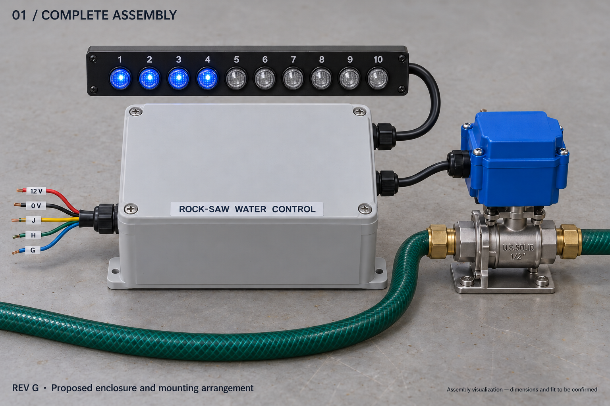
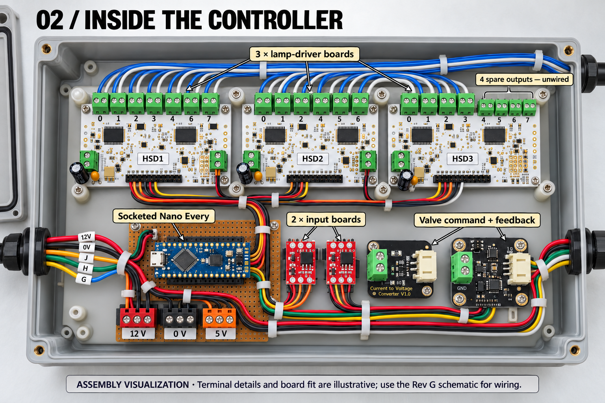
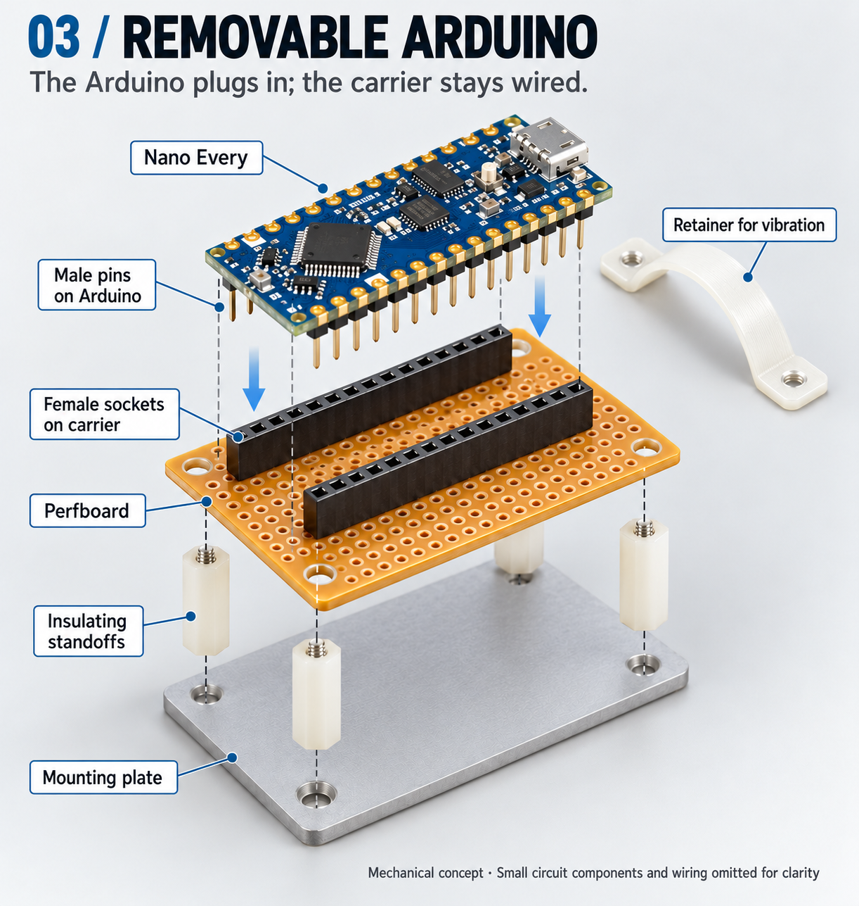
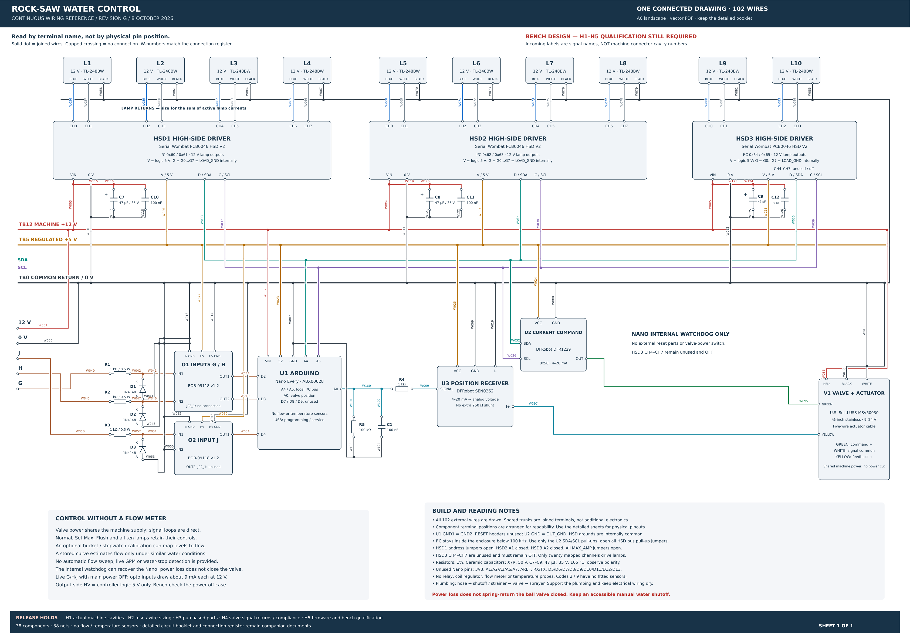
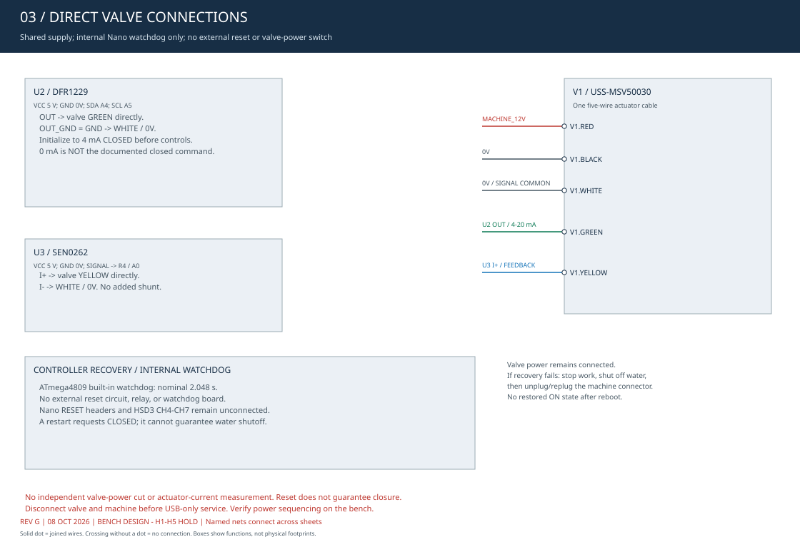

# Rock Saw Water Control

**[▶ Open Live Simulator](https://aeae1.github.io/Rock-Saw-Water-Control/)** · **[Operator guide](docs/operator-guide.md)** · **[Single-page schematic](docs/assets/hardware/water-controller-single-page-rev-g.pdf)** · **[Firmware v1](firmware/README.md)** · **[Shopping list (Markdown)](docs/shopping-list.md)** · [Build and wiring guide](docs/build-guide.md) · [Electrical audit](docs/assets/hardware/water-controller-audit-rev-g.pdf)

A configurable attachment water controller for machines that provide three independent operator-control outputs. The proposed system adjusts a motorized water valve and presents operating status on ten blue/white indicator lamps. Typical applications include rock saws and other attachments supplied from a pressurized water hose.

**Project status:** interactive simulator and Revision G electrical bench design. The [connection audit](docs/hardware-audit-rev-g.md) includes circuit sheets, 102 individual connections, parts, tests and power-up checks. Machine harness verification, protection coordination, actual component qualification, actuator characterization and firmware/bench testing remain release holds. [Firmware v1.0.0-bench](firmware/README.md) is included and compiled for the Nano Every. Physical qualification is still required.

## Assembly views

[](docs/assets/hardware/assembly-complete-rev-g.png)

*Complete assembly concept. The water hoses connect to the valve plumbing. Separate electrical cables connect the enclosure to the lamp display and valve actuator.*

| Enclosure interior | Removable Arduino carrier |
| :---: | :---: |
| [](docs/assets/hardware/assembly-interior-rev-g.png) | [](docs/assets/hardware/assembly-carrier-rev-g.png) |
| Proposed board placement and cable routing. | The Arduino plugs into sockets while the carrier remains wired. |

**Illustration limits:** these AI-generated assembly concepts show the intended arrangement. Some rendered terminal counts, numbering, and component details differ from the actual boards. Enclosure dimensions, board fit, and the carrier layout remain provisional. Use the [Revision G schematic](docs/assets/hardware/water-controller-single-page-rev-g.pdf), connection schedule, and actual component markings for assembly. Select an image to view it at full size. [Illustration provenance and scope](docs/assets/hardware/assembly-views-rev-g.md).

## Wiring schematic

**[Open the complete single-page schematic — PDF](docs/assets/hardware/water-controller-single-page-rev-g.pdf)** · [Zoomable SVG](docs/assets/hardware/water-controller-single-page-rev-g.svg) · [Schematic and audit booklet](docs/assets/hardware/water-controller-audit-rev-g.pdf)

The overall A0 sheet is **one continuous wiring drawing**: all 102 external wires reach their terminals, with all 38 references, joined power/ground rails and individual lamp leads shown together. Junction dots identify connections; gaps identify unconnected crossings. Component terminals are arranged for tracing and are not physical footprints. Zoom the vector PDF/SVG or print at A0. The detailed multipage booklet remains available for individual circuits, pin orientation and qualification instructions. [Single-page verification record](docs/single-page-schematic-review-rev-g.md) · [Every-wire connection schedule](hardware/rev-g/connections.csv) · [Parts schedule](hardware/rev-g/bom.csv)

[](docs/assets/hardware/water-controller-single-page-rev-g.pdf)

<details>
<summary>Valve circuit detail and individual sheets</summary>

[](docs/assets/hardware/rev-g-03-valve.svg)

The preview shows direct valve power/command/feedback with no external reset circuit. The package contains six detail sheets, the electrical audit and the connection schedule. Revision G removes Q1/R11/R12; HSD3 CH4-CH7 and Nano RESET remain unconnected. D7, D8 and D9 remain unused; no permanent flow or temperature sensors are fitted.

1. [Power, returns and local I²C bus](docs/assets/hardware/rev-g-01-power.svg)
2. [G/H/J input conditioning](docs/assets/hardware/rev-g-02-inputs.svg)
3. [Direct valve wiring and internal watchdog](docs/assets/hardware/rev-g-03-valve.svg)
4. [Valve position feedback](docs/assets/hardware/rev-g-04-feedback.svg)
5. [All twenty lamp-color outputs](docs/assets/hardware/rev-g-05-lamps.svg)
6. [Component pin orientation and assembly notes](docs/assets/hardware/rev-g-06-terminals.svg)

</details>

## Components

| Function | Current component direction (no flow meter) |
| :--- | :--- |
| Main controller | [Arduino Nano Every](https://store-usa.arduino.cc/products/nano-every), supplied through VIN from the machine's nominal 12 V supply |
| Operator inputs | Two SparkFun BOB-09118 two-channel opto boards with three external 1 kohm input resistors and reverse-voltage diodes; their HV terminals receive regulated 5 V |
| Lamp switching | Three [Serial Wombat PCB0046 HSD](https://www.serialwombat.com/p46) V2 boards: twenty lamp outputs and four unused outputs. Current price and availability have not been verified. |
| Indicators | Ten common-negative 12 V blue/white lamps; each color has its own switched positive lead |
| Valve command | [DFRobot DFR1229](https://wiki.dfrobot.com/dfr1229/) configured for 4–20 mA current output |
| Valve feedback | [DFRobot SEN0262](https://wiki.dfrobot.com/sen0262/) converts position feedback to a voltage for the Nano's analog input; this receiver is not an I²C device |
| Water valve | [U.S. Solid USS-MSV50030](https://ussolid.com/products/1-2-proportional-motorized-ball-valve-stainless-steel-dc-9-24v-4-20ma-control-5-wire-ip67-full-port), 1/2-inch stainless proportional ball valve with integrated actuator |
| Controller recovery | Nano internal hardware watchdog, nominal 2.048 s; no external reset circuit or extra board; bench verification required |

The reference installation reuses its existing 14-pin connector for the constant 12 V supply, wired ground return, and three control signals. Power is distributed inside the controller; the selected layout relies on the existing machine fuse and includes no additional fuse block or separate power source. This is an installation-specific arrangement, not a universal connector pinout. Whether the supply remains live with the ignition off must be verified: startup behavior follows controller power-up or reset, not necessarily the machine's key cycle.

The valve has **one five-conductor cable from its actuator housing**. The motor and position-control electronics are inside that housing; there are no electrical connections to the stainless valve body or water hoses. The [manufacturer's wiring table](https://file.ussolid.com/content/JFMSV/Manual-5003X.pdf) identifies red as power positive, black as power negative, green as command positive, white as signal common, and yellow as position-feedback positive.

The electronics require a suitable weatherproof enclosure. Power budgets, fault behavior and environmental suitability require bench verification. The current [electrical audit](docs/hardware-audit-rev-g.md) supersedes earlier wiring concepts; the [2026-10-03 audit](docs/audit-2026-10-03.md) remains the historical software review. Automated wiring checks validate the documented topology, not physical field reliability.

## Simulator

**Hardware distinction:** Revision G has no independent valve-power cutoff or actuator-current detector. Its firmware fault response sends a closed command when communication remains usable, then verifies feedback. A failed command path can leave water flowing. The simulator retains its existing fault-motion model and simulated code 2 for UI testing; those behaviors are not proof of Revision G shutdown. See the [firmware v1 guide](firmware/README.md).

The simulator implements the proposed operator interface, valve motion, maximum-opening configuration, startup indication, and diagnostic previews. It operates entirely in the browser and requires no account or network connection after loading.

To run locally, open [`docs/index.html`](docs/index.html) in a current browser, or serve the `docs` directory:

```sh
python3 -m http.server 8000 --directory docs
```

Then open `http://localhost:8000`. GitHub Pages configuration is described in [Publishing](docs/publishing.md). The hosted version is available at [aeae1.github.io/Rock-Saw-Water-Control](https://aeae1.github.io/Rock-Saw-Water-Control/).

## Machine compatibility

The control scheme requires three functions: **increase**, **decrease**, and **toggle/setup**. These can be provided by a two-direction joystick rocker plus a trigger, three suitable joystick outputs, or equivalent operator controls. The control logic is independent of the machine manufacturer.

The Takeuchi TL12R2 with an HDRS24 rock saw is the reference installation. The attachment manufacturer has not been confirmed. Its G, H, and J labels are used in the simulator and table below; other machines can map their outputs to the same functions. Connector type, supply voltage, signal polarity, protection, and existing attachment functions must be verified for each installation. Three available outputs establish the interface concept, not plug-and-play electrical compatibility.

## Operating interface


The illustration shows the reference machine controls schematically. It is not a connector pinout.

### Three modes

| Mode | Purpose | Controls |
| :--- | :--- | :--- |
| **Normal** | Everyday water adjustment | Tap J for on/off. G increases the level; H decreases it. |
| **Set Max** | Choose what level 10 means | Hold J for 1.5 seconds from Normal, then release. G/H changes the cap from 10–100%. Tap J to save and return. |
| **Flush** | Temporarily open the valve fully | In Set Max, release J and hold it again for 1.5 seconds. A fresh J press returns immediately to the previous Normal on/off state. |

Start with G/H centered and J released. Startup checks all ten lamps in a two-second test: all white for one second, then all blue for one second while commanding closing. After both finish, it requires released/centered controls for 0.1 seconds before accepting a fresh command. Faults immediately override the lamp test. A held startup input cannot trigger an action on release. G/H makes one change per activation; center or reverse to rearm. A tap is shorter than 0.5 seconds. Releasing J between 0.5 and 1.5 seconds cancels the hold without changing anything.

In Set Max, running water holds its current valve opening while the cap is edited. An existing OFF command continues closing. Saving selects the nearest repeatable opening under the new cap: 40% opening becomes level 8 at a 50% maximum, or level 7 at a 60% maximum (42% opening). Flush temporarily bypasses the cap and locks G/H.

Blue lamps indicate the running level; white lamps indicate the saved paused level. While paused, the maximum lamp blinks blue/off above the white bar or blue/white within it. Set Max uses one alternating blue/white lamp. Mode-changing holds show an inward white fill after 0.5 seconds; Flush uses an outward white ripple.

In the simulator, faults latch and inhibit opening. Settings/input faults (6, 7, 10) command the valve closed while retaining the fault display; faults involving the valve-control path (1–5, 8) inhibit movement. Any latched movement-inhibiting fault takes priority, even after its cause clears. Each numbered lamp blinks white while its cause is active and blue after it clears. All latched codes are shown together; all causes must be cleared before reset. The simulator provides one toggle per cause for testing simultaneous faults. Correct the cause, release J, then hold J for three seconds to acknowledge. Holding or moving G/H does not affect fault acknowledgement. During the reset hold, code lamps stay blue while a white fill sweeps across all ten positions, spending 0.3 seconds per position even behind a blue code. When the hold completes, the normal paused display returns immediately: the saved-level bar is white and the maximum marker blinks blue. Reset keeps water off: a confirmed closed valve does not move again; otherwise closing/requalification finishes. After closure and 0.1 seconds with J released, a fresh J tap works with G/H still held. Earlier rocker actions are discarded. **Stopping movement or losing electrical power does not guarantee that water stops.** The [operator guide](docs/operator-guide.md) explains routine use and recovery; the [fault reference](docs/faults.md) defines the supported codes, reserved code 9 and detection limits.

The current simulator uses valve-opening percentages. Firmware v1 can optionally use a manually measured [flow-calibration curve](docs/flow-calibration.md) so levels represent estimated calibrated flow percentages. Collect volume and time through the actual hose/nozzles; there is no permanent meter, automatic flow sweep or live GPM. Position feedback remains required and cannot prove water has stopped. The water animation is illustrative. Settings and fault latches survive the simulator's power switch, but reset on page reload.

## Architecture

The current bench direction is the [wiring schematic](#wiring-schematic): an Arduino Nano Every, conditioned machine inputs, prebuilt high-side lamp drivers, and a wired proportional valve with 4–20 mA command and feedback. Ten dual-color lamps require twenty independently switched power channels. The valve includes its motor, gearbox, and motor controller; it needs no separate motor or H-bridge.

The [build guide](docs/build-guide.md) describes wiring relationships and the programming sequence. The [Markdown shopping list](docs/shopping-list.md) provides quantities, sellers, product links and dated prices without requiring a spreadsheet. The [procurement guide](docs/shopping-guide.md) adds enclosure choices and a battery-first test plan. The complete quoted cost remains open because driver-board pricing and several assembly choices are unverified. The [valve-control research](docs/valve-control-research.md) retains the cheaper reversing-valve and Tuya alternatives. Local Tuya percentage control has not been verified for the candidate smart valve.

## Documentation

| Document | Purpose |
| :--- | :--- |
| [Operator guide](docs/operator-guide.md) | Plain-language instructions for Normal, Set Max, Flush, and recovery |
| [Build and wiring guide](docs/build-guide.md) | Current component direction (no flow meter), partial pricing, wiring and enclosure plan |
| [Shopping and enclosure guide](docs/shopping-guide.md) | Dated prices, purchase holds, enclosure/coating choices, optional bench supplies and staged battery testing |
| [Shopping list (Markdown)](docs/shopping-list.md) | Primary purchase list: quantities, sellers, links, prices, allowances and alternatives |
| [Audit and remaining work](docs/audit-2026-10-03.md) | Verified fixes, test evidence and hardware acceptance gaps |
| [Fault reference](docs/faults.md) | Ten latched fault codes, acknowledgement, and detection requirements |
| [Control specification](docs/control-specification.md) | State transitions, timing, rounding, and retention rules |
| [Connection diagrams](docs/connections.md) | Conceptual power, signal, lamp, and water connections |
| [Hardware candidates](docs/hardware.md) | Candidate components and unresolved selection criteria |
| [Valve-control research](docs/valve-control-research.md) | Wired proportional control, Tuya feasibility, prices, and bench investigation |
| [Planning BOM](docs/bom.csv) | Current quantities, dated prices and unresolved procurement items |
| [Validation plan](docs/validation.md) | Simulator coverage and hardware acceptance work |
| [Firmware v1](firmware/README.md) | Upload instructions, configuration, logging, tests and bench limits |
| [Artwork swatches](docs/artwork.md) | Four banner directions and corresponding color palettes |

## Development

Node.js 22 or later is required for development. The published simulator has no runtime package dependencies.

```sh
npm ci
npm run check
```

Edit `simulator/source.html`, then run `npm run build`. The build extracts committed HTML, CSS and JavaScript under `docs/`. The deterministic checks cover the simulator and electrical documentation, including 2,000 level/cap/on-off combinations, ordered fault pairs and seeded stress actions. Electrical mutation tests reject wrong power/reset wiring, missing connections and lamp-channel conflicts. Historical revision comparisons remain; F-to-G checks that only the reset branch is removed and the incoming endpoints renamed. Documentation checks validate all 102 drawn wires, 38 references, continuous geometry, shopping coverage and export hashes. GitHub Actions runs Node.js 22/24 checks and browser cases across desktop Chromium, mobile Chromium and mobile WebKit.

Firmware has a separate sanitizer-enabled native test suite and a real Nano Every build in CI. Run `bash scripts/test-firmware.sh`; see [firmware v1](firmware/README.md) for Arduino build/upload steps and the [test report](firmware/TESTING.md).

To run browser checks locally:

```sh
npx playwright install --with-deps chromium webkit
npm run test:browser
```

The test suite covers simulator behavior and the documented circuit topology. The firmware compiles and passes software tests; actual boards, valve motion and enclosure performance still need bench acceptance before field deployment.

## Scope and attribution

This is an independent project and is not affiliated with Takeuchi or the component manufacturers. The original machine artwork was supplied for this project. The selected red-stripe banner contains an unchanged, native-size copy of the original artwork. Four earlier AI-assisted banner studies are retained as superseded design swatches; they are not technical representations of the machine.

Assembly illustrations are AI-generated concept art. The current Revision G diagrams are programmatically drawn circuit documentation with explicit physical qualification holds; neither constitutes manufacturer-approved installation guidance.

No project-wide redistribution license has been selected. Third-party product names and marks retain their respective ownership.
