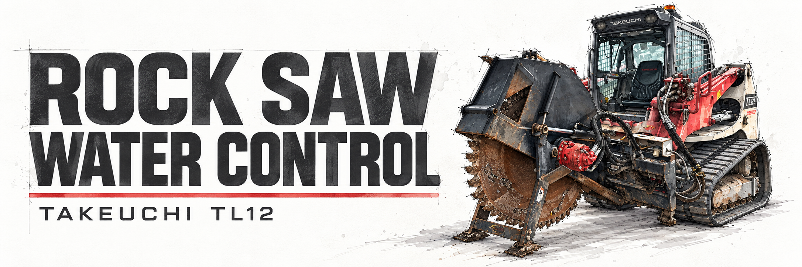
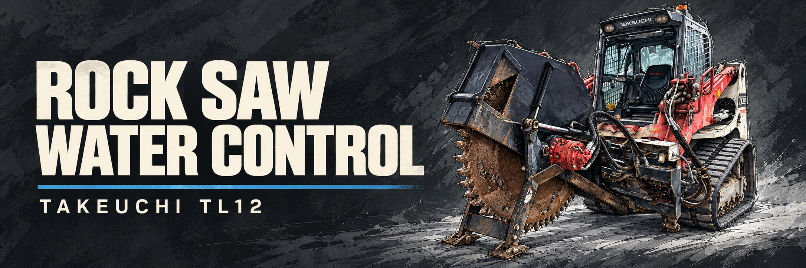
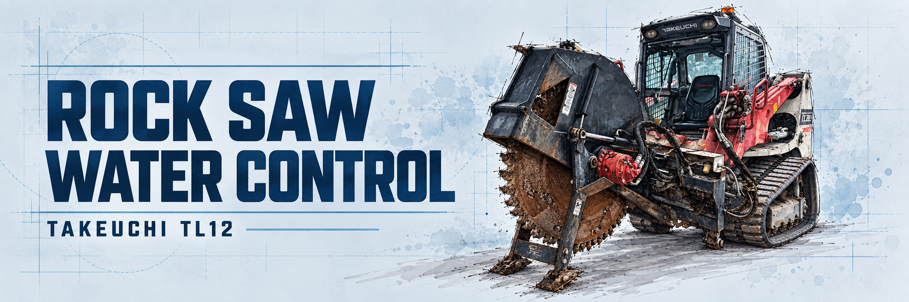
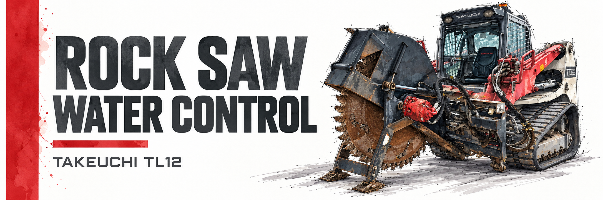

# Artwork and Color Swatches

The selected banner uses the supplied JPEG as an unchanged image. Its decoded RGB pixels are pasted at native size into a new layout; no machine details are regenerated. The source JPEG is preserved separately.

The red-stripe direction has been selected. The four earlier AI-assisted concepts are retained below as design history and may contain altered equipment details.

Palette values are representative design colors. The selected banner reuses the approved watercolor stripe, title lettering, and red accent; its machine is copied exclusively from the original artwork.

## Selected: Red Stripe — Original Artwork

Original artwork pasted at native resolution, with no generative edits or resampling. Equipment line: TAKEUCHI TL12R2 / HDRS24.

Palette: `#D93135` · `#242A2F` · `#FFFFFF`

## Technical White

Superseded AI-assisted concept.

Palette: `#FAFAF8` · `#242A2F` · `#D93135`

## Graphite

Superseded AI-assisted concept.

Palette: `#232A30` · `#F5F0DE` · `#2D83AE`

## Blueprint

Superseded AI-assisted concept.

Palette: `#DDEAF1` · `#07365A` · `#5C9ABD`

## Red Editorial

Superseded AI-assisted concept that established the selected red-stripe direction.

Palette: `#FFFFFF` · `#242A2F` · `#D93135`

## Source and reproduction

- [Original artwork](assets/artwork/original.jpeg)
- [Selected banner](assets/artwork/red-stripe-original.png)
- [Initial concept prompts](assets/artwork/prompts.json)
- [Deterministic composition script](../scripts/compose-banner.py)

The selected banner was composed with Pillow at the user’s explicit request to paste the exact artwork, retaining the watercolor stripe and title from the approved concept. The initial concept variants used the built-in image-generation tool. Reproduction requires Pillow and the font paths specified in the composition script. Fonts are not bundled.
