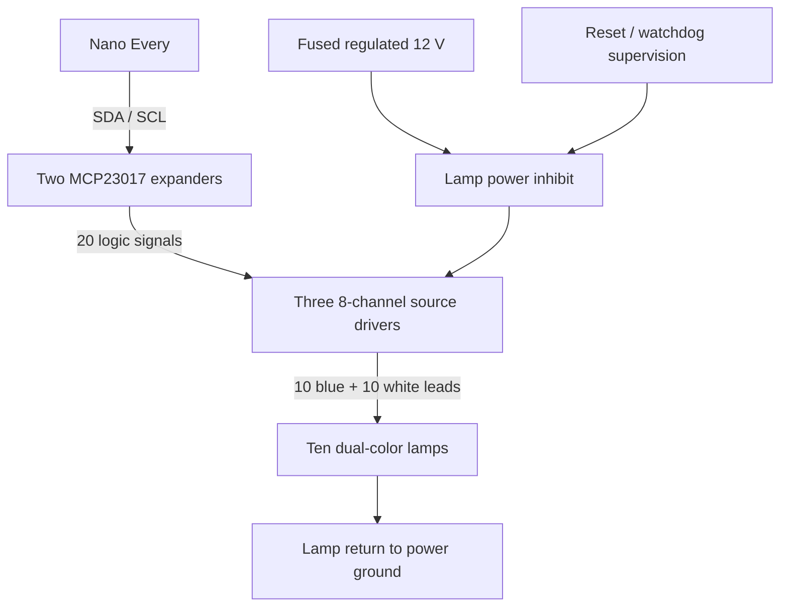

# Build and Wiring Plan

Reviewed 2026-10-01 · Bench candidates and estimated field-completion costs

This plan uses a **1/2-inch U.S. Solid wired proportional valve**, an **Arduino Nano Every**, and **ten separately controlled blue/white lamps**. The valve includes its motor, gearbox, and motor controller. No additional motor, reversing H-bridge, Tuya account, Wi-Fi access point, or permanent flow meter is required for this approach.

The simulator and its fault policy are implemented. Flashable machine firmware, the protected carrier PCB, and a construction-ready machine pinout are not yet supplied. Buy the bench parts first; choose the harness and finalize the carrier after measurements.

## Core bench parts

Listed prices are USD before shipping and tax. They are observed supplier prices, not an assembly quotation. A starred item is conditional on the lamp/valve bench results.

| Quantity | Component | Purpose | Extended price |
| ---: | :--- | :--- | ---: |
| 1 | [Arduino Nano Every ABX00028](https://store-usa.arduino.cc/products/nano-every) | Runs the controls, calibration lookup, faults, and lights | $12.90 |
| 1 | [U.S. Solid USS-MSV50033](https://ussolid.com/products/1-2-proportional-motorized-ball-valve-brass-dc-9-24v-4-20ma-control-5-wire-ip67-full-port) | 1/2-inch proportional valve with command and feedback | $99.99 |
| 1 | [DFRobot DFR1229 / GP8600](https://www.dfrobot.com/product-3073.html)* | I²C to current command; verify loop load and startup behavior | $15.90 |
| 1 | [DFRobot SEN0262](https://www.dfrobot.com/product-1755.html) | Converts valve feedback current into a readable voltage | $4.90 |
| 1 | [Adafruit ADS1115 #1085](https://www.adafruit.com/product/1085) | Reads feedback with better resolution/reference stability than the onboard ADC | $14.95 |
| 2 | [Adafruit MCP23017 #5346](https://www.adafruit.com/product/5346) | 32 logic outputs; 20 used for the lamp colors | $11.90 |
| 3 | [Toshiba TBD62783APG](https://www.mouser.com/en/c/?q=TBD62783A)* | 24 high-side power channels; 20 used, if lamps are common-negative | $7.35 |
| 1 | [Pololu S18V20F12 #2577](https://www.pololu.com/product/2577)* | Regulated 12 V bench/assembly rail; field input protection still required | $29.95 |
| | **Core parts subtotal** | Does not include lamps, protection, enclosure or wiring | **$197.84** |

A laptop, Micro-B USB data cable, current-limited 12 V bench supply, multimeter, soldering equipment, temporary rocker/button controls, and bench wiring are also needed. Budget another $20–40 for small bench accessories if the tools and supply are already available. Do not run the valve or twelve-volt lamps through a solderless breadboard power rail for field use.

The Nano Every is an economical, sufficient controller for this state machine. Its manufacturer specifies 7–21 V VIN and 5 V logic. Feed VIN from the protected, regulated 12 V rail. Use its 5 V output for small logic modules only after checking their combined current and regulator temperature; otherwise provide a separate regulated 5 V peripheral branch without tying two regulator outputs together. USB is for bench programming/service. The entire installed assembly needs environmental qualification; a chip temperature rating is not a completed controller rating.

The newer [DFR1229 documentation](https://wiki.dfrobot.com/dfr1229/) specifies a 3.3–5 V supply and a current-output mode. This replaces the earlier DFR0972 candidate that needs 18–24 V. Use I²C, set the current-output range explicitly, and establish 4 mA before enabling valve power. Its raw current scale is documented as 0–20 mA; zero raw output is **not** the 4 mA closed command. Check actual current at 4, 12, and 20 mA into the valve, along with reset/bus-loss behavior. Software library availability does not establish compatibility with the valve's input impedance or a safe startup output.

## The complete lamp controller

The selected lamp is the user-supplied [BJZ B0CT8G71TW](https://www.amazon.com/BJZ-Trailer-Marker-Clearance-Indicator/dp/B0CT8G71TW/), replacing the earlier PSEQT reference. A twelve-volt ready lamp contains its own LED current-limiting arrangement. The external parts below are electronic **on/off switches**, not an extra constant-current LED power supply. Full wiring/current specifications for this exact listing were not retrievable; confirm them from the supplied lamps before final construction.

These are twelve-volt lamp assemblies, so the I/O expanders provide commands and the power drivers provide lamp current. For the expected common-negative wiring, the architecture is:

The [Toshiba datasheet](https://toshiba.semicon-storage.com/info/docget.jsp?did=30523) and [application note](https://toshiba.semicon-storage.com/info/docget.jsp?did=35900) describe source-type outputs. These are **high-side** switches. A ULN2803 sink board is not a substitute for a common-negative lamp. If the supplied lamps instead share positive, use a suitable sink-driver design and revise the wiring. Verify the actual color leads rather than relying on insulation colors from an advertisement.

A proposed mapping, suitable for a labeled carrier board:

| Expander | Outputs | Driver channels | Lamp leads |
| :--- | :--- | :--- | :--- |
| MCP #1, address 0x20 | Port A 0–7 | Driver #1, 1–8 | Blue 1–8 |
| MCP #1, address 0x20 | Port B 0–7 | Driver #2, 1–8 | White 1–8 |
| MCP #2, address 0x21 | Port A 0–3 | Driver #3, 1–4 | Blue 9, White 9, Blue 10, White 10 |
| MCP #2 | Remaining pins | Unused/reserved | Keep unused driver inputs low |

Each lamp needs blue, white, and common. Joining commons inside the bar means the cable between a remote driver box and the bar needs **20 switched conductors plus a suitably sized return**. Use a connector with enough contacts and adequate common-return current capacity. Putting the controller/driver board directly behind the lamps substantially simplifies this wiring. If the two assemblies must be several feet apart, either use the multicore lamp harness or a properly designed differential display link; do not run bare I²C across the machine.

Implement off/blue/white as the only allowed per-lamp states. Turn an old color off before enabling its replacement. Initialize expander output latches low before configuring outputs, add defined input pull-downs and local decoupling, and keep lamp supply inhibited during controller reset. Verify the no-flash sequence with hardware: an I²C expander can retain outputs while the MCU reboots.

The TBD62783 is an inexpensive bench candidate, **not a protected automotive output bank**. It lacks internal overcurrent/overvoltage protection and per-channel diagnostics. Use branch protection and design the carrier's power inhibit; do not rely on a large upstream fuse to protect a small driver from a short. Calculate total package dissipation with the measured lamp currents and hot-box temperature. If the lamps are too demanding, use higher-current protected high-side switches instead. The 500 mA absolute maximum is not permission to run every channel at that current. A final short-circuit-tolerant field design may cost more than the bare-chip allowance.

All current animations use on/off color switching, so hardware PWM is unnecessary. If adjustable dimming becomes a requirement, select PWM-capable drivers or a separate dimming stage at that point.

## Valve wiring

The wire colors below are from the [U.S. Solid 5003X manual](https://file.ussolid.com/content/JFMSV/Manual-5003X.pdf); verify the supplied unit and revision before connecting it.

| Valve wire | Function | Proposed connection |
| :--- | :--- | :--- |
| Red | DC power positive | Fused, supervised regulated 12 V actuator branch |
| Black | DC power negative | Actuator power return |
| Green | 4–20 mA command positive | DFR1229 OUT in current mode |
| White | Command/feedback signal negative | DAC output GND and receiver signal return, per confirmed loop/common design |
| Yellow | 4–20 mA position feedback positive | SEN0262 current input positive |

SEN0262's voltage output goes to ADS1115 A0. Its current-input return joins valve signal common; its logic-side ground joins the controller analog ground as specified by the module wiring. Check continuity/common relationships before tying signal and power returns; neither module provides assumed galvanic isolation. Keep actuator/lamp current out of the analog return trace. The receiver is not a connector-short protection circuit: protect feedback against accidental power injection.

For physical opening `p` in percent, command current is `4 + 0.16 × p` mA. J-off requests 4 mA. The planned flow lookup translates requested flow to `p` first. Feedback measures reported position, not water flow. Characterize whether feedback actually follows shaft position during a jam.

The manual lists no manual override, a maximum working current of 500 mA, and up to eight seconds for travel. Characterize inrush and travel under the real hose pressure before choosing branch protection, stall thresholds, and motion timeout. Do not reuse the simulator's five-second stroke as firmware timing.

## Machine power and controls

1. Identify the machine connector, cavity numbering viewed from the correct side, ground, switched supply, G, H, and J. Compare the correct machine/harness documentation and meter readings. Do not assume that the G/H/J control labels prove the connector cavity assignments.
2. Use a dedicated fused branch at the tap, reverse-polarity protection, coordinated surge suppression/disconnection, input filtering, and regulated supplies. The Pololu module alone is not a load-dump-rated vehicle power front end. Its recommended input ceiling is 30 V. Clamp/disconnect design must protect the lowest-rated downstream part under actual pulses, not merely carry a “12 V” label.
3. Bring G/H/J through three protected input channels with current limiting, reverse/transient protection, filtering and clean logic thresholds, preferably optocoupler or suitable industrial input receivers. Feed conditioned logic to Nano D2/D3/D4. Never feed raw machine voltage into GPIO or an expander.
4. Use a documented pass-through/breakout harness that preserves the required attachment functions. Confirm that sensing these lines cannot energize or backfeed any hydraulic solenoid. If a selected output already drives a hydraulic function, the electrical routing must be deliberately resolved before using it for water.
5. Provide an independent watchdog/supervisor with an output-inhibit path. The installed design must define what happens if the DAC holds its last value while the MCU freezes. Removing actuator power may stop motion but is not guaranteed closure.

Fuse ratings, wire gauges, TVS/surge-controller parts and optocoupler resistor values depend on measured voltage, lamp load, harness length and connector ratings. Those are the remaining electrical design inputs, not missing software features. Observe cranking, alternator operation and attachment switching; a steady multimeter reading alone cannot characterize voltage spikes.

## Suggested low-voltage pin allocation

This is a proposed controller map, not the fourteen-pin machine map.

| Nano connection | Use |
| :--- | :--- |
| VIN / GND | Protected regulated 12 V / logic power return |
| D2 / D3 / D4 | Conditioned G / H / J |
| A4 SDA / A5 SCL | Local I²C: DAC 0x58, ADC 0x48, expanders 0x20 and 0x21 |
| D5 | Watchdog heartbeat, supervised independently |
| D6 | Actuator enable request through protected hardware; default disabled |
| D7 | Lamp enable request through protected hardware; default disabled |
| A0 | Protected divided rail-voltage measurement |
| A1 | Conditioned actuator-current measurement |
| A2 | Conditioned enclosure temperature measurement |
| A3 | Optional actuator-region temperature or spare |
| USB | Programming and wired service log |

Voltage division, current-sense and temperature circuits require their own protection, reference scaling and fault detection. Reserve inputs now so those functions do not require replacing the controller later. Keep I²C short inside the enclosure, calculate combined pull-up resistance, and use bounded bus timeouts; a failed lamp expander must not hang valve control.

## Enclosures and mounting

A useful main-box candidate is the gray UV-stabilized polycarbonate **[Hammond 1554VA2GY](https://www.hammfg.com/part/1554VA2GY)**, 240 × 160 × 90 mm, with a removable internal plate. Allow approximately $45–65 for the box; price is an allowance, not a fixed quotation. Use the polycarbonate version: the [1554 series specification](https://www.hammfg.com/electronics/small-case/plastic/1554) identifies its ABS versions as indoor products. The enclosure's environmental rating does not automatically transfer to holes added for lamps, connectors, or glands.

Place electronics on standoffs or a secured carrier, with locking connectors, strain relief and service labels. Fit correctly sized sealed cable glands, a suitable hydrophobic pressure-equalization vent, and a drip loop. Place the lid/connector entries away from direct wash spray and debris. Use a light-colored shade/hood and locate the enclosure away from the engine, exhaust and hot hydraulic lines. Check the sealed operating temperature in full sun; a box that survives heat does not necessarily keep the electronics cool. Conformal coating can help after validation, but keep it off contacts and service connectors.

The ten-lamp bar may need its own longer housing, depending on measured lamp diameter and desired spacing. Measure the lamps before ordering that housing or drilling a lid. A shallow sun hood and dark label face improve contrast. Provide mounting depth for lamp bodies, bending radius and strain relief. If one larger box can sit in a visible protected location, putting the board behind the lamps avoids a bulky twenty-one-conductor display cable.

The valve has the tighter environmental limit: its manual gives an ambient ceiling of **50°C / 122°F** and warns against excessive vibration. Mount it in a shaded, protected location with its actuator upright, independently supported plumbing and flexible hose sections. Avoid direct attachment vibration where feasible. Confirm that the location remains within the valve limits; otherwise this inexpensive valve is not the right field part. Drain/freezing and parked-machine sun exposure also need a practical plan. IP67 does not mean unrestricted pressure washing, UV durability or vibration qualification.

## Plumbing and calibration supplies

Use garden-hose supply → manual shutoff → strainer → motorized valve → actual spray hose/manifold/nozzles. Add removable unions or quick connections so replacement does not require rewiring the assembly. Match hose-thread/NPT adapters explicitly; 3/4-inch garden-hose thread and NPT are different. Support hose pull separately from the actuator.

For the [flow calibration](flow-calibration.md), use the actual downstream nozzle restrictions, a pressure gauge, a measured container/scale and timing method. A temporary inline flow meter is optional. A regulator can improve consistency if incoming pressure always leaves adequate margin; it cannot restore pressure that the supply lacks.

## Field-completion budget

These allowances include categories that often disappear from a cheap board-only estimate. They are not exact product quotes and may change after load/mounting measurements.

| Additional item | Allowance |
| :--- | ---: |
| Main polycarbonate enclosure | $45–65 |
| Carrier PCB, terminals, passive components and mounting | $15–25 |
| Input protection, power protection and watchdog/inhibit circuitry | $50–90 |
| Voltage/current/temperature sensing components | $20–35 |
| Machine connector/breakout harness | $35–100 |
| Wire, sealed connectors, glands and vent | $35–60 |
| Manual shutoff, strainer, adapters and hose connections | $25–50 |
| Separate lamp housing/hood if required | $20–40 |
| **Additional parts allowance** | **$245–465** |
| **Core parts plus completion allowance** | **$442.84–662.84** |

Budget approximately **$445–665 plus the lamps, shipping, tax and labor** for this more complete prototype. Tools, a purchased bench supply, a permanent flow meter, independent fail-close valve, professional harness/PCB assembly and redesigns are excluded. If the lamps are already owned, do not buy them again. Combining controller and lamp housings can remove the separate-display allowance. A higher-capacity or protected output stage may increase the budget.

## Programming and assembly sequence

1. **Bench bring-up:** USB-program the Nano, use temporary G/H/J switches, confirm input polarity/debounce and all ten lamp colors through the driver bank. Use a current-limited supply. Verify default-off lamp outputs through power sequencing and disconnected I²C.
2. **Valve characterization:** prove 4/12/20 mA and feedback scaling, repeat partial moves, reversals, stop-at-position behavior, unpowered behavior, broken command/feedback and startup. Keep water isolated during initial electrical work. Confirm an independent way to inhibit continued motion after a controller freeze.
3. **Firmware port:** implement a nonblocking C++ state machine matching the simulator. Separate inputs, gestures, modes, calibration, valve command/feedback, diagnostics, lamps and persistent storage. Use bounded I²C calls, integer/fixed-point scaling where practical, wrap-safe time comparisons and no animation delays in the main control loop.
4. **Storage and recovery:** version and checksum calibration/settings; write only committed changes with a wear-aware redundant record. Startup is OFF, closes/references, then requires neutral controls. Brownout/watchdog and fault records must prevent silent run resumption.
5. **Flow curve:** gather measured data, validate and load a monotone lookup table, then test every level/cap combination. Calibrated-flow percentages become the operator scale only after this data is installed.
6. **Field carrier and harness:** replace temporary wiring with secured soldered/connectorized construction. Finalize measured load, fuse, driver heat, pinout and input protection. Label cables, valve wires, connector views, board revision and firmware version.
7. **Acceptance:** run the firmware's own unit tests and hardware fault-injection tests, including corrupted settings, timer wrap, sensor disconnection, shorts within a controlled test setup, low voltage, restart with held controls, heat, vibration and repeated wet operation. Simulator CI is useful but cannot certify the finished hardware.

Arduino C++ is appropriate here; the controller does not need Linux or cloud software. The Nano can be serviced over USB from a laptop. Keep a known-good firmware release and, once the design is validated, a spare programmed controller/valve for service.
