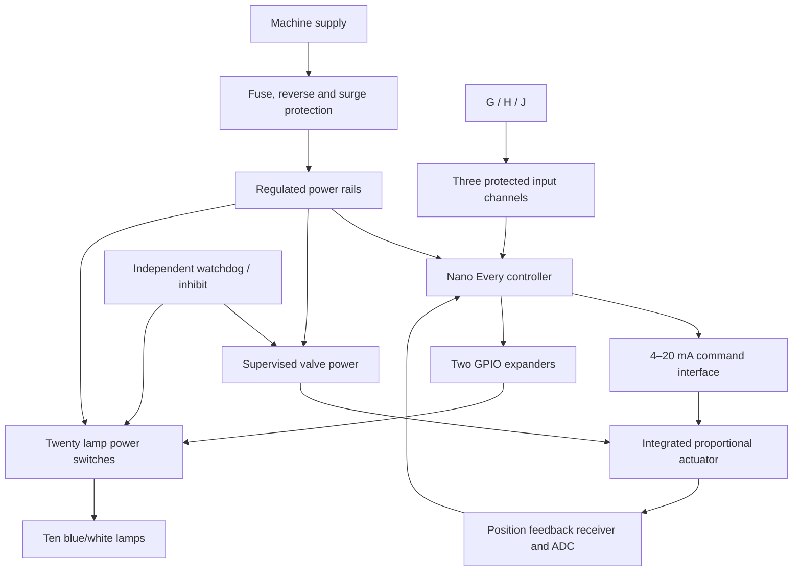
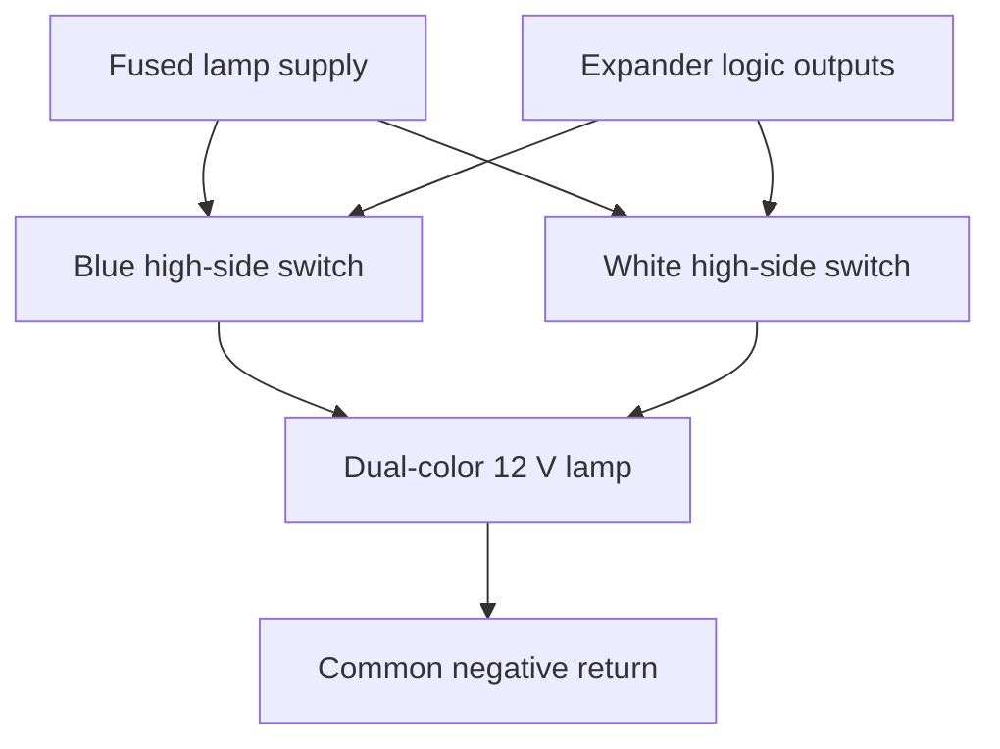

# Conceptual Connections

The architecture applies to machines with three independent controls: increase, decrease, and trigger. The Takeuchi TL12R2 / HDRS24 is the reference installation. G/H/J identify operator functions here; they are not a released machine connector pinout.

The [build guide](build-guide.md) contains the proposed controller pin allocation, valve wire table, complete lamp-switch mapping and enclosure plan. Protection values, wire gauges and machine connector cavities require measurements before construction.

## Preferred proportional-valve architecture

The proportional valve contains its motor and motor controller. Do not connect an external reversing H-bridge to it. The lower-cost two-wire reversing alternative requires a different output circuit, described in [valve research](valve-control-research.md).

Power returns join at a designed distribution point; keep valve and lamp current out of the analog signal return. Machine inputs are conditioned before reaching GPIO. Input protection, rail supervision and a hardware inhibit remain necessary even if the microcontroller can accept a nominal twelve-volt VIN supply.

## One lamp, repeated ten times

This topology uses common-negative lamps with separately powered color leads, independent of brand. Nilight documents this arrangement for its TL-248BW example; confirm polarity and per-color current on the actual supplied units. They are complete twelve-volt lamps; the external electronics switch power and do not replace their internal LED current limiting. Use one color at a time. Common-positive lamps require a revised low-side circuit. See the [build guide](build-guide.md) for example products and manufacturer references.

Twenty switched color leads plus a shared return connect a remote lamp bar. A controller located behind the lamps keeps those wires short. Do not use long unbuffered I²C wiring between separated enclosures.

## Water and installation

Garden-hose supply → manual shutoff → strainer → proportional valve → actual attachment hose/manifold/nozzles. Use removable fittings, independently supported plumbing and flexible hose sections. Match garden-hose and NPT threads explicitly. The flow curve must be measured through this complete downstream restriction.

Before assigning machine connector cavities, record voltage, polarity, switch behavior and existing attachment connections. Confirm water commands cannot unintentionally energize hydraulic functions. Sources for the reference harness include [Skid Steer Genius technical resources](https://www.skidsteergenius.com/pages/technical) and its [help center](https://www.skidsteergenius.com/apps/help-center); use the exact machine/harness documentation and verify the fitted wiring.
