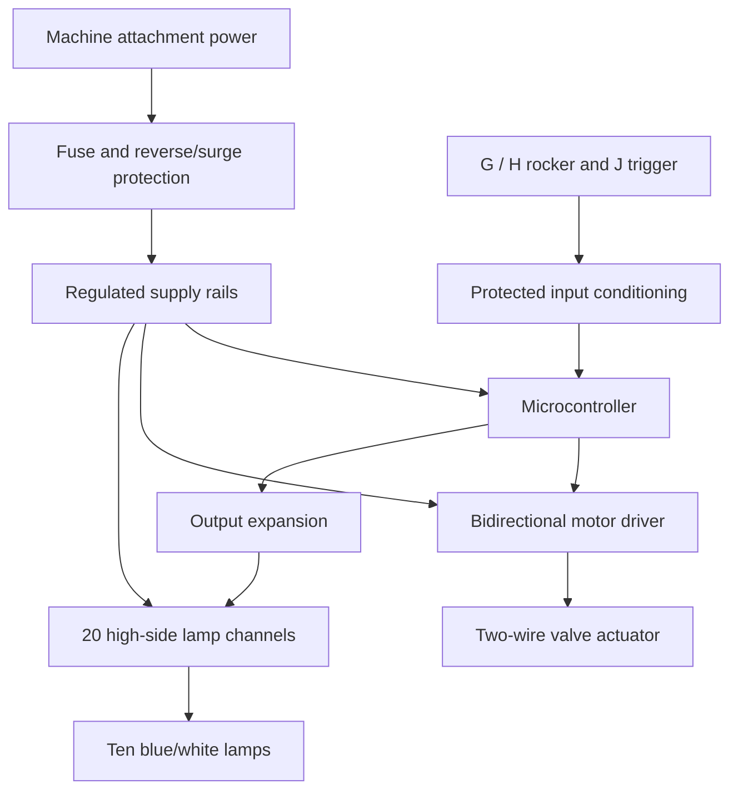
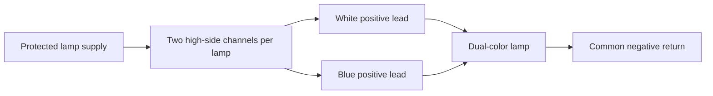

# Conceptual Connections

The architecture applies to machines with three independent operator-control outputs: increase, decrease, and toggle/setup. The Takeuchi TL12R2 / HDRS24 is the reference installation. Other machines require their own harness mapping and input conditioning.

These diagrams define functional interfaces. Connector cavities, protection-component values, conductor sizes, and driver details are not released for construction. G, H, and J below identify intended operator functions; their electrical behavior must be verified on the specific TL12R2 and attachment harness.

## Power and control

The wired candidate uses regulated 12 V for a compatible valve, lamp bank, and Nano Every VIN. A different controller may require a separate regulated logic supply. A nominal 12 V machine connector is not a clean logic-level supply. Never connect machine control lines directly to microcontroller GPIO.

Ground returns join at the designed power distribution point. Motor output terminals are a reversing pair; neither is a permanent ground. Suppression and protection must suit bidirectional drive. The controller commands the H-bridge; it does not supply motor current through GPIO.

## Lamp connections

Repeat the circuit for lamps 1–10. The proposed three-wire lamps share a negative lead, so independently selecting white and blue requires twenty switched positive outputs. The intended wire identification is black common negative, white white-positive, and blue blue-positive; verify the supplied batch before assembly. Only one color channel per lamp should be enabled at a time. Driver ratings depend on measured current and enclosure temperature.

## Water path

Garden-hose supply → manual isolation and suitable strainer → motorized valve → attachment hose/manifold → saw spray outlets. Select adapters to match the actual hose and valve threads; nominal 3/4-inch garden-hose threads and 3/4-inch NPT are different interfaces. Support the plumbing and protect the actuator and wiring from debris and attachment motion.

## Interface verification

Before assigning connector cavities, measure supply voltage, ground, and G/H/J operation on this machine. Record polarity, switched behavior, latching behavior, and current capacity. Verify that the selected signals cannot unintentionally operate the saw's hydraulic solenoids through the existing harness. This project controls water; existing depth and wheel-alignment functions remain part of the machine/attachment system.

Pinout references: [Skid Steer Genius technical resources](https://www.skidsteergenius.com/pages/technical) and [help center](https://www.skidsteergenius.com/apps/help-center). Published mappings are reference material and do not replace identification of the fitted harness.
