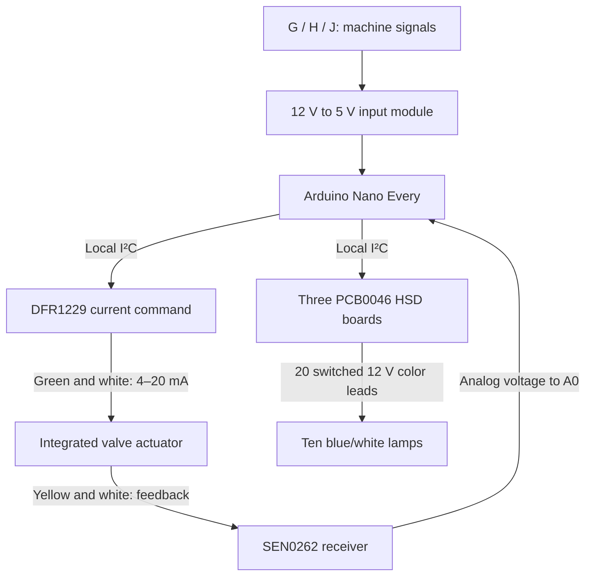
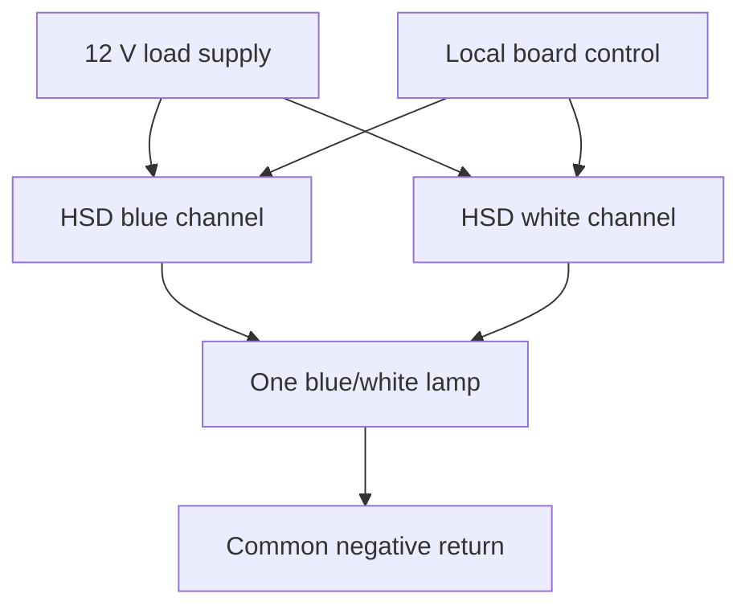

# Conceptual Connections

Reviewed 2026-10-03 · Current Arduino / prebuilt-HSD / stainless proportional-valve direction

These diagrams show functions, not terminal-level construction wiring. G/H/J mean increase, decrease and trigger; they are not verified machine connector cavities. Use the [build guide](build-guide.md) for the current cable functions, board addresses and lamp allocation.

## Control and feedback

The receiver uses an analog input. The proportional actuator includes its motor and controller; no external reversing H-bridge is involved. The HSD boards combine I/O expansion and high-side switching.

## Power distribution

| Source / branch | Loads and returns |
| :--- | :--- |
| Existing machine connector, constant 12 V | Nano VIN, HSD load inputs and actuator power branch |
| Connector wired ground | Power distribution return; separate load and analog-return routing |
| Nano low-voltage rail, after load/thermal verification | HSD logic, DFR1229, SEN0262 and input board logic |
| Each HSD switched output | One blue or white lamp-positive lead |
| Lamp common negatives | Ground distribution, sized for combined current |
| Valve red / black | Actuator positive / power negative |

This reference installation uses the existing machine fuse and assumes clean nominal 12 V. No additional fuse block or separate source is included. Constant power does not identify key state. Current capacity, key-off behavior and the unfinished fault-inhibit circuit must be resolved before field use. Never power lamps or the valve through Nano GPIO or the 5 V logic rail.

## One lamp, repeated ten times

Only one color is commanded at a time. Switch the old color off before enabling the new one. A remote lamp bar needs twenty switched leads plus its power return; placing the boards behind the bar keeps these wires short. Do not use machine-length bare I²C wiring.

## Water and machine installation

Garden-hose supply → manual shutoff → strainer → stainless valve → actual saw hose/manifold/nozzles. Support plumbing separately and use removable fittings and flexible sections. Match garden-hose and NPT thread types explicitly. The valve's single electrical cable exits the actuator box; there are no wires connected to the hose or stainless body.

Before assigning machine cavities, record voltage, polarity, connector viewing direction, G/H latch behavior and existing hydraulic wiring. Confirm that connecting this controller cannot energize an existing hydraulic function. [Skid Steer Genius technical resources](https://www.skidsteergenius.com/pages/technical) and its [help center](https://www.skidsteergenius.com/apps/help-center) are reference starting points; a generic fourteen-pin diagram is not a verified TL12R2 harness pinout.
