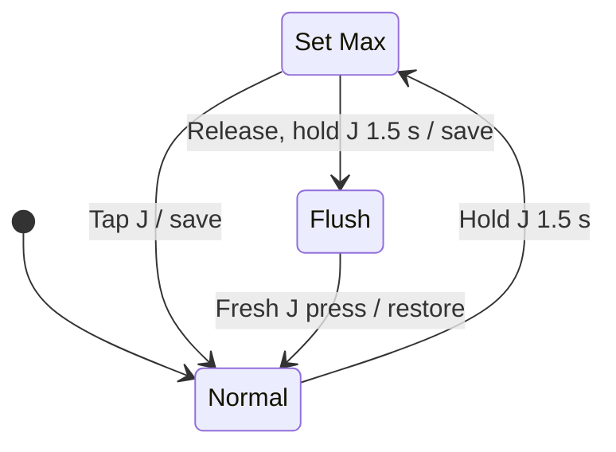

# Control Specification

Revision 0.4 · Reviewed 2026-10-03

## State variables

| Variable | Range or values | Initial value |
| :--- | :--- | :--- |
| Machine power | Off, on | Off |
| Water command | Paused, on | Paused |
| Selected level | Integer 1–10 | 4 |
| Saved maximum | 10–100%, in 10-point increments | 100% |
| Draft maximum | 10–100%, in 10-point increments | Saved maximum |
| Saved resume opening | Level × maximum / 10 | 40% |
| Simulated valve position | 0–100% | 0% |
| Mode | Normal, Set Max, Flush | Normal |
| Cleaning return command | Paused, on | Paused |
| Rocker state | G, center, H | Center |
| Diagnostic | None or one/more latched codes 1–10 | None |

The opening scale represents actuator travel. It does not imply linear water flow, an encoder, or measured position in a physical controller.

## Normal operation

G and H increment or decrement the level once per activation, within 1–10. A direction remains latched until the rocker returns to center or reverses. A reversal is interpreted as passage through center. Holding a direction produces no autorepeat. While J is being held, G/H movement is tracked physically but cannot adjust a setting. That activation is consumed; it is not replayed after J is released.

A J press shorter than 500 ms toggles the water command on release. Releasing at 500–1,499 ms cancels without action. A 1,500 ms hold changes mode. Classify release by elapsed time even if a timer callback is delayed. The on target is the saved resume opening; the paused target is fully closed. A long press must not produce a subsequent short-press toggle.

## Set Max

1. Hold J continuously for 1.5 seconds. Enter setup at the threshold.
2. If the water command is on, stop simulated motion and retain the valve position reached at entry. If off, continue any existing closing motion. Releasing J leaves Set Max active.
3. Set the reference opening to the actual simulated position if the water command was on, or to the saved resume opening if paused.
4. Adjust a draft maximum with G/H. Do not move the valve or change the committed maximum while editing.
5. Display only the lamp at `draft maximum / 10`, alternating blue and white every 600 ms.
6. Tap J to commit, quantize, and exit, or release J and hold it again for 1.5 seconds to commit and enter full-open cleaning.

The committed level is calculated as follows. Exact halfway values round upward.

```text
boundedReference = min(referenceOpening, newMaximum)
newLevel = clamp(round(boundedReference × 10 / newMaximum), 1, 10)
resumeOpening = newLevel × newMaximum / 10
valveTarget = previousWaterCommandIsOn ? resumeOpening : 0
```

| Reference opening | New maximum | New level | Resume opening |
| ---: | ---: | ---: | ---: |
| 40% | 50% | 8 | 40% |
| 40% | 60% | 7 | 42% |
| 42% | 30% | 10 | 30% |
| 30%, paused | 50% | 6 | 30%; valve remains closed |
| 0%, on during initial motion | 50% | 1 | 5% |

Level zero is reserved for the off command and is not a selectable running level. Set Max cannot interrupt an existing OFF command. Closing continues during editing and saving.

## Flush

From maximum setup, a second 1.5-second J hold commits the draft maximum and quantizes the saved resume opening using the calculation above. It then records the prior normal on/off command and commands 100% actuator opening. This temporarily bypasses the saved maximum without changing that maximum or rescaling the saved level from the cleaning position. G/H adjustments are ignored, but the physical rocker state is updated. A direction engaged during Flush cannot replay on exit; center/re-engage or reverse for a new adjustment. A Flush hold started while an OFF command is still closing is ineligible for that entire press; a fresh hold is required after closure.

Any fresh J press returns immediately, on press-down, to Normal: move to the saved resume opening if previously on, or close if previously paused. Return is available while the valve is still opening. The exit press is consumed; continuing to hold or releasing it cannot toggle water or enter another mode. The original entry press must be released before exit is available. Each hold can cause only one mode change; J must be released before another hold can advance a mode.

Power loss or an injected fault clears cleaning and the return command. Recovery commands closing and does not automatically resume cleaning.



## Paused maximum indication

Once closing finishes, white lamps show the saved level. The lamp at `saved maximum / 10` alternates blue with its underlying color every 600 ms: off above the saved-level bar, or white within the bar. At a 70% maximum and level 4, lamp 7 alternates blue/off; at level 7 or higher, it alternates blue/white. The marker remains active for the entire paused state and never changes the valve target. Startup lamp testing, running, fill/drain, hold-progress, setup, cleaning, fault, and unpowered displays take precedence.

Idle blinking uses one scheduled timeout per color change. Reduced-motion mode uses a steady blue maximum marker and no idle animation timer. Delayed browser callbacks resume at the current phase without replaying missed changes.

## Startup and power interruption

On controller power-up, the water command is paused and the valve is commanded closed. Saved level and maximum are retained. A two-second lamp test runs concurrently with closing: all ten lamps illuminate white for one second, then all ten illuminate blue for one second. The same sequence applies in reduced-motion mode. All operator commands are ignored throughout the test; raw inputs remain monitored so held controls and faults are still detected. All opening commands are locked until both the lamp test and closure/reference complete, then J is released and G/H is centered continuously for 100 ms. Input states are observed even while power is off, closing is underway, or faults inhibit commands. Activations while locked are consumed, not queued. Any control activity restarts neutral qualification. A held J cannot enter setup or toggle on release, and a held G/H cannot edit settings or arm operation. A fresh activation is required after arming. Once the lamp test and closing finish, the standard persistent paused maximum indication applies. A fault immediately cancels the test and takes display priority; a fault already latched at power-up suppresses it entirely. Fault acknowledgement does not restart the test. Power removal cancels it; the next healthy power-up starts again with all lamps white. Delayed callbacks complete the test by elapsed time without replaying missed steps. The test is a visual check of both lamp colors, not automatic proof of lamp health or valve closure. The 100 ms qualification verifies stable neutral controls; it is not a display delay.

Removing power extinguishes all lamps, cancels motor motion at the current simulated position, discards an unsaved draft, and clears the water command. The simulated actuator is non-return: electrical power loss does not mechanically shut off water. On the next power-up, closing is commanded again.

The reference installation uses a constant-hot feed. A machine key cycle does not necessarily interrupt controller power or reset its mode; ignition sensing and a master disconnect are not implemented.

Settings persist across the simulator's power switch within the current page session. Reloading the page resets the model. Physical firmware will require versioned nonvolatile settings and a power-up position-reference procedure.

## Animation and timing

| Parameter | Simulator value |
| :--- | :--- |
| Full actuator stroke | 5 seconds |
| Minimum modeled move | 200 ms |
| Maximum-mode J threshold | 1.5 seconds |
| Paused/setup color-change interval | 600 ms |
| Hold-feedback delay | 500 ms |
| Startup lamp test | 2 seconds; 1 second all white, 1 second all blue |
| Startup/recovery neutral qualification | 100 ms after startup prerequisites |
| Hold-progress inward pair interval | 200 ms |
| Cleaning outward pair interval | 180 ms |

Fill progresses from left to right as the modeled valve opens. Drain replaces blue with white from right to left as it closes. During either mode-changing J hold, the existing lamp display is retained for the first 500 ms. After that delay, white lamp pairs fill inward from both ends during the remaining second. The progress bar and hold-specific labels follow the same delay. The mode still changes at 1,500 ms from the original press. Early release or cancellation removes the hold display and resets the feedback delay for the next press. Cleaning uses white pairs moving outward from the center across blue lamps, followed by one all-blue interval before repeating. Reduced-motion mode uses steady white lamps during a hold and a steady white center pair on blue during cleaning. Timing is illustrative and must be replaced by characterized actuator behavior in firmware.

## Faults and recovery

The [fault contract](faults.md) defines ten latched codes and the required physical detection hardware. The simulator injects all ten and automatically detects J held for 30 seconds. Cause removal alone is insufficient: require neutral controls and explicit acknowledgement by a fresh three-second J hold, or the simulator Reset now shortcut. Acknowledgement starts closing/reference recovery and never restores an ON or Flush command. Multiple faults remain latched and every corresponding code lamp is displayed; the lowest code is named in the heading. Each injected cause has its own toggle, independent of its latch. White/off identifies active causes, blue/off cleared causes. Valid reset holds reserve all code lamps in solid blue and fill the remaining lamps white from left to right over three seconds. Acknowledged code lamps remain blue through closure and neutral qualification. See the fault contract for blocked-hold, warning and reduced-motion patterns. A hold is eligible only if all causes are absent and G/H centered at its start; removing causes during a blocked hold does not promote it into a valid reset. Power cycling does not clear a latch in the current page session.

The browser models a stopped actuator after faults. The physical proportional actuator requires a characterized output-inhibit method; loss of its command signal is not assumed to stop it.

## Planned flow calibration

The current simulator remains an actuator-opening model. The approved next hardware step is a measured flow lookup curve, described in [Flow calibration](flow-calibration.md). With a validated curve, Set Max will cap calibrated flow and the ten levels will divide that flow cap. Before changing the simulator's percentage meaning, provide the measured data; no invented valve curve is used here.

## Input timing and simulator limits

Switch controls remain operable when commands are inhibited so held-startup and fault cases can be reproduced. This does not grant those inputs permission to move the valve. G and H represent one mutually exclusive physical rocker; wiring faults that assert both are represented by injected fault 7. Electrical debounce and simultaneous-input detection remain firmware work.

The stuck-J duration counts powered time for the current press, restarting on an actual simulated power cycle. Both timed callbacks and release handling check elapsed time, so a delayed browser callback cannot bypass fault 10 or enter Flush first. A fault-reset hold requires G/H centered throughout; moving the rocker cancels it even if re-centered before three seconds. Release J and start a fresh acknowledgement.

Pointer cancellation, matching capture loss, page hiding and window focus loss cancel a browser gesture without producing a tap. These browser events are not substitutes for sampling physical switches in firmware. Another pointer, a secondary mouse-button release, unrelated key release, or key-repeat event must not complete or duplicate J.
