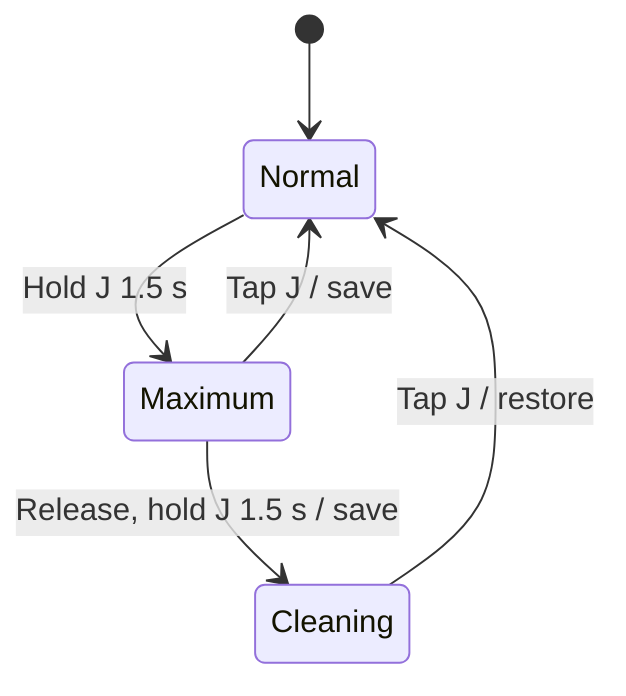

# Control Specification

Revision 0.2 · Design baseline

## State variables

| Variable | Range or values | Initial value |
| :--- | :--- | :--- |
| Machine power | Off, on | Off |
| Water command | Paused, on | Paused |
| Selected level | Integer 1–10 | 4 |
| Saved maximum | 10–100%, in 10-point increments | 100% |
| Draft maximum | 10–100%, in 10-point increments | Saved maximum |
| Saved resume opening | Level × maximum / 10 | 40% |
| Simulated valve position | 0–100% | 0% |
| Mode | Normal, maximum setup, full-open cleaning | Normal |
| Cleaning return command | Paused, on | Paused |
| Rocker state | G, center, H | Center |
| Diagnostic | None, driver, conflicting inputs | None |

The opening scale represents actuator travel. It does not imply linear water flow, an encoder, or measured position in a physical controller.

## Normal operation

G and H increment or decrement the level once per activation, within 1–10. A direction remains latched until the rocker returns to center or reverses. A reversal is interpreted as passage through center. Holding a direction produces no autorepeat. While J is being held before entry into setup, normal G/H adjustment is ignored.

A short J press toggles the water command on release. The on target is the saved resume opening; the paused target is fully closed. A long press must not produce a subsequent short-press toggle.

## Maximum setup

1. Hold J continuously for 1.5 seconds. Enter setup at the threshold.
2. Stop simulated motion and retain the valve position reached at entry. Releasing J leaves setup active.
3. Set the reference opening to the actual simulated position if the water command was on, or to the saved resume opening if paused.
4. Adjust a draft maximum with G/H. Do not move the valve or change the committed maximum while editing.
5. Display only the lamp at `draft maximum / 10`, alternating blue and white every 600 ms.
6. Tap J to commit, quantize, and exit, or release J and hold it again for 1.5 seconds to commit and enter full-open cleaning.

The committed level is calculated as follows. Exact halfway values round upward.

```text
boundedReference = min(referenceOpening, newMaximum)
newLevel = clamp(round(boundedReference × 10 / newMaximum), 1, 10)
resumeOpening = newLevel × newMaximum / 10
valveTarget = previousWaterCommandIsOn ? resumeOpening : 0
```

| Reference opening | New maximum | New level | Resume opening |
| ---: | ---: | ---: | ---: |
| 40% | 50% | 8 | 40% |
| 40% | 60% | 7 | 42% |
| 42% | 30% | 10 | 30% |
| 30%, paused | 50% | 6 | 30%; valve remains closed |
| 0%, on during initial motion | 50% | 1 | 5% |

Level zero is reserved for the off command and is not a selectable running level. If setup is entered while a closing valve is still moving, motion stops at that intermediate position; saving while paused resumes closing.

## Full-open cleaning

From maximum setup, a second 1.5-second J hold commits the draft maximum and quantizes the saved resume opening using the calculation above. It then records the prior normal on/off command and commands 100% actuator opening. This temporarily bypasses the saved maximum without changing that maximum or rescaling the saved level from the cleaning position. G/H inputs are ignored.

A short J press returns directly to normal operation: move to the saved resume opening if previously on, or close if previously paused. Return is available while the valve is still opening. A long hold within cleaning leaves cleaning active. Each hold can cause only one mode change; J must be released before another hold can advance a mode.

Power loss or an injected fault clears cleaning and the return command. Recovery commands closing and does not automatically resume cleaning.



## Paused maximum indication

Once closing finishes, white lamps show the saved level. The lamp at `saved maximum / 10` alternates blue with its underlying color every 600 ms: off above the saved-level bar, or white within the bar. At a 70% maximum and level 4, lamp 7 alternates blue/off; at level 7 or higher, it alternates blue/white. The marker remains active for the entire paused state and never changes the valve target. Running, fill/drain, hold-progress, setup, cleaning, fault, and unpowered displays take precedence.

Idle blinking uses one scheduled timeout per color change. Reduced-motion mode uses a steady blue maximum marker and no idle animation timer. Delayed browser callbacks resume at the current phase without replaying missed changes.

## Startup and power interruption

On machine power-up, the water command is paused and the valve is commanded closed. Saved level and maximum are retained. Once closed, the standard persistent paused maximum indication applies. There is no separate startup display or startup timer.

Removing power extinguishes all lamps, cancels motor motion at the current simulated position, discards an unsaved draft, and clears the water command. The simulated actuator is non-return: electrical power loss does not mechanically shut off water. On the next power-up, closing is commanded again.

Settings persist across the simulator's power switch within the current page session. Reloading the page resets the model. Physical firmware will require versioned nonvolatile settings and a power-up position-reference procedure.

## Animation and timing

| Parameter | Simulator value |
| :--- | :--- |
| Full actuator stroke | 5 seconds |
| Minimum modeled move | 200 ms |
| Maximum-mode J threshold | 1.5 seconds |
| Paused/setup color-change interval | 600 ms |
| Hold-feedback delay | 500 ms |
| Hold-progress inward pair interval | 200 ms |
| Cleaning outward pair interval | 180 ms |

Fill progresses from left to right as the modeled valve opens. Drain replaces blue with white from right to left as it closes. During either mode-changing J hold, the existing lamp display is retained for the first 500 ms. After that delay, white lamp pairs fill inward from both ends during the remaining second. The progress bar and hold-specific labels follow the same delay. The mode still changes at 1,500 ms from the original press. Early release or cancellation removes the hold display and resets the feedback delay for the next press. Cleaning uses white pairs moving outward from the center across blue lamps, followed by one all-blue interval before repeating. Reduced-motion mode uses steady white lamps during a hold and a steady white center pair on blue during cleaning. Timing is illustrative and must be replaced by characterized actuator behavior in firmware.

## Diagnostic previews

| Code | Meaning | Response |
| ---: | :--- | :--- |
| 4 | Motor-driver fault | Stop motor commands; inhibit operator commands |
| 7 | Conflicting control inputs | Stop motor commands; inhibit operator commands |

The simulator's fault selector injects these conditions; it does not read physical diagnostics. Clearing a preview commands closing while powered. White fault indication flashes three times and then remains steady; reduced-motion mode uses steady indication. Stopping an actuator does not establish closed position. Physical diagnostic detection and recovery remain unimplemented.
