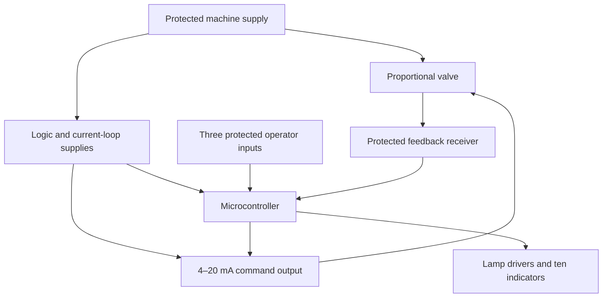

# Valve Control Research

Historical comparison reviewed 2026-10-01; current selection updated 2026-10-03. Alternative prices below are dated observations. Use the [build guide](build-guide.md) for the current stainless-valve design and budget.

## Recommendation

The current selection is the **U.S. Solid USS-MSV50030, 1/2-inch stainless wired proportional valve**. The brass USS-MSV50033 below is a historical comparison. Use the wired interface before considering a smart-valve modification. It provides a documented percentage-control input and position-feedback output. The **USS-MSV00012 reversing valve** remains the lowest-cost candidate when estimated opening is sufficient. The Tuya route is feasible to investigate, but compatibility with a current production unit has not been demonstrated.

All three assemblies include the actuator motor and gearbox. No additional mechanical motor is required. Each alternative needs its own electrical interface; the external H-bridge applies only to the reversing valve.

## Valve size

The current pricing basis is **1/2 inch**, with 3/8 inch retained as an option if a suitable two-way controllable valve is identified. This reflects the reference installation's restricted spray head; it does not prescribe a valve size for other machines. Verify adequate spray at the weakest expected supply pressure with the actual hose length and nozzle. Nominal thread size alone does not establish usable flow or control resolution.

A [3/8-inch U.S. Solid listing](https://ussolid.com/products/38-3-way-brass-motorized-ball-valve-2-wire-9-24v-acdc-l-type-standard-port-with-manual-function-ip67) is $69.67, but it is a three-way L-port routing valve, not the two-way proportional candidate needed here. A suitable 3/8-inch two-way U.S. Solid percentage-control model was not verified in this review. The 1/2-inch range currently offers a clearer selection.

The newer [build guide](build-guide.md) selects DFR1229 ($15.90, 3.3–5 V supply) as the next current-output bench candidate and SEN0262 to the Nano onboard ADC for feedback. The older DFR0972 comparison below is retained for reference. The [flow-calibration plan](flow-calibration.md) defines the intended measured lookup curve.

## Component price comparison

Manufacturer listed prices, USD, before tax and shipping; retrieved on the review date. This is not a complete project quotation.

| Candidate | Valve price | Interface and additional parts |
| :--- | ---: | :--- |
| [USS-MSV00012, 1/2-inch brass](https://ussolid.com/products/u-s-solid-motorized-ball-valve-1-2-brass-electrical-ball-valve-with-full-port-9-24-v-dc-2-wire-reverse-polarity-html) | $37.86 | Reversing motor driver; calibrated timed movement without position feedback |
| [USS-MSV00087, 1/2-inch brass smart valve](https://ussolid.com/products/wifi-12-brass-remote-control-motorized-ball-valve-with-power-off-memory-5v-dc-usb-manual-switch) | $86.29 | Regulated 5 V power and a verified local network or internal serial interface |
| [USS-MSV50033, 1/2-inch brass proportional valve](https://ussolid.com/products/1-2-proportional-motorized-ball-valve-brass-dc-9-24v-4-20ma-control-5-wire-ip67-full-port) | $99.99 | 4–20 mA command output and protected feedback input |
| [DFRobot DFR0972 current-output module](https://www.dfrobot.com/product-2625.html) | $9.90 | Candidate interface for the proportional valve; requires an 18–24 V supply |

The smart price is for the 5 V USB version; an AC wall adapter is unnecessary for the machine installation. The separate [USS-MSV10090 smart model](https://ussolid.com/products/wifi-smart-motorized-ball-valve-1-2-2-way-brass-usb-powered-led-status-indicator) is listed at $86.25 with IP67, but its command set and internal hardware must be verified independently. Do not assume interchangeability with USS-MSV00087, which is listed as IP65.

The proportional valve costs **$13.70 more than the smart valve**. Valve plus the example current-output module totals **$109.89**, excluding its supply converter, feedback receiver, controller, protection, lamps, enclosure, harness, and plumbing. The complete total remains open until those parts are selected. None of these alternatives eliminates the protected machine inputs or lamp-driver bank.

## Documented wired percentage control

The [5003X manufacturer manual](https://file.ussolid.com/content/JFMSV/Manual-5003X.pdf) specifies 9–24 V DC power, a 4–20 mA command, and 4–20 mA position feedback. Its mapping is 4 mA closed and 20 mA fully open. For a commanded opening `p` in percent:

```text
command_mA = 4 + 0.16 × p
```

Thus 40% opening requires 10.4 mA. The controller would translate the ten-level/max setting into this current; J-off commands 4 mA while retaining the saved operating level.



The DFR0972 communicates over I²C and has an [Arduino library](https://github.com/DFRobot/DFRobot_GP8302). Its logic-high specification is 2.7–5 V, but its current-output stage requires **18–24 V**, so a nominal 12 V machine needs a separate converter for this module. It cannot be powered directly from an ESP32's 3.3 V rail. Receiver design must respect the selected controller's ADC limits and the valve feedback-output requirements.

The proportional-valve listing specifies IP67 and ambient −15 to 50°C. It recommends shelter for permanent outdoor installation. Its manual also advises avoiding excessive vibration. These limits require an appropriate mounting location and field evaluation on an attachment; IP67 alone does not establish UV or vibration suitability. Power-loss and broken-signal behavior require bench verification: a generic “normally closed” label is insufficient evidence of a dependable return mechanism.

## Tuya: evidence and implementation options

U.S. Solid's [own integration guide](https://ussolid.com/blogs/motorized-ball-valve/how-to-control-multiple-wifi-smart-ball-valves-simultaneously) demonstrates sending an opening percentage through Tuya's cloud developer interface. This establishes software control of the advertised function. It does **not** establish a supported local Arduino API.

A [first-person teardown report from March 2022](https://community.home-assistant.io/t/new-tuya-wifi-bluwtooth-smart-valve-great-for-hydronic-control/403709/7) identifies a Tuya wireless module and a separate STC8H1K08S2A10 motor-control MCU in an earlier U.S. Solid smart valve. The author writes the module name as “WS3B”; that marking should not be silently treated as a verified WB3S identification. No working conversion is demonstrated in that thread, and current production hardware may differ.

### Option A: local Wi-Fi, original controller retained

[TinyTuya](https://github.com/jasonacox/tinytuya) supports direct LAN control for several Tuya protocol versions. It is useful on a computer for identifying the owner's device version, local key, and available data points after pairing. Its setup wizard uses a Tuya account to obtain keys; ongoing local commands can be separate from the cloud if the device supports them.

An ESP32 implementation is possible in principle. For example, [LynkTuyaLocal](https://github.com/F1chter/LynkTuyaLocal) advertises Arduino/ESP32 support for protocol versions 3.4 and 3.5 and arbitrary integer data-point writes. It is an experimental candidate, not a verified driver for this valve. Match the actual device protocol before choosing a library. Validate bounded timeouts and startup behavior; a stalled network call must not block the operator-input state machine.

A dedicated local access point could remove dependence on a job-site router. Cold boot, prolonged internet disconnection, reconnection, and loss of the access point all require tests. Keep local keys and Wi-Fi credentials out of this public repository.

### Option B: wired serial control, original motor controller retained

If the purchased valve has separate wireless and actuator MCUs communicating through a compatible UART protocol, a microcontroller can potentially take the wireless module's place. [ESPHome's Tuya MCU component](https://esphome.io/components/tuya/) implements such a serial connection and can enumerate reported data points. This is supporting evidence for the architecture, not proof for a particular U.S. Solid revision.

The bench investigation would:

1. Record the exact model, board revision, chip markings, connector layout, and firmware version before modification.
2. Measure logic voltage and passively capture both serial directions while the original app commands several known openings, closed, open, and any stop function.
3. Identify command and report types, scaling, acknowledgements, startup exchange, and heartbeat behavior. Distinguish a reported target from measured position.
4. Isolate the original module's transmitting output before introducing another transmitter. Retain the actuator MCU, driver, limit protection, and any position sensor. Use verified logic levels; machine voltage must never reach UART pins.
5. Implement bounded parsing, packet validation, timeout handling, and controlled startup. Prove repeatable operation before resealing the housing.

Tuya's official [Arduino MCU SDK](https://github.com/tuya/tuya-wifi-mcu-sdk-arduino-library) is designed for an appliance MCU to receive commands from a Tuya module. It is not a ready-made master driver for commanding an existing valve MCU. A module-side implementation or a compatible existing Tuya-MCU integration is required for this modification.

Reflashing the wireless module is a third possibility if its exact chip and board are supported. No flashing instructions or pin assignments are released without inspecting that hardware. Soldering or replacing a module changes sealing and serviceability; a replacement valve may have a different board revision.

## Required behavior before either percentage interface is accepted

The simulator assumes that entering Set Max **holds the actual current opening while commanded on**, including during opening travel. An OFF command continues closing. A percentage command alone does not prove this capability. Verify a stop-and-hold command, or sufficiently current position feedback and a demonstrated hold-at-position method. Do not substitute the previous target for actual position. If the selected valve cannot satisfy this behavior, the operator specification must be revisited explicitly.

The smart model's listing specifies 5 V power, 8–10-second travel, and an ambient ceiling of 45°C / 113°F. Its [manual](https://file.ussolid.com/content/JFMSV/Instruction%20Manual-U.S.%20Solid%20Smart%20Motorized%20Ball%20Valve2025.pdf) and product page describe power-loss closure and configurable power-off states. Verify the supplied unit's configured behavior, including after a short powered interval and a controller reset. The simulator currently models the non-return reversing-valve baseline, not that smart-valve behavior.

For either interface, test repeated partial moves under water pressure, direction reversals, stalls, unplugged signals, brownouts, controller watchdog resets, invalid commands, and high enclosure temperature. Record position error, latency, repeatability, and recovery. Percentage opening is not percentage flow or a GPM measurement. Existing simulator tests validate the user interface; they do not validate these physical functions.

## Selection outcome

The stainless USS-MSV50030 wired proportional model is the selected **next bench candidate** when repeatable percentage settings matter. The reversing model remains the economy option. The Tuya serial path is a credible development project for an owner comfortable with soldering, with the decisive unknowns being the current board design, protocol, actual-position reporting, and stop behavior.
